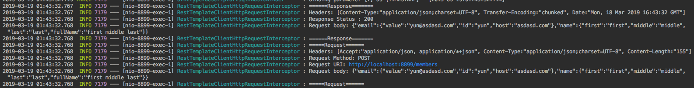
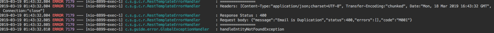

# API Call Guide

이번 주제는 외부 API 호출 가이드를 진행하겠습니다. 본 포스팅에서는 RestTemplate 기반으로 설명하고 있지만 RestTemplate에 대한 사용법이 초점은 아닙니다. Request, Response에 대한 로킹, Interceptors를 통한 추가 작업, errorHandler을 통한 각 Vendor마다 예외 처리 전략을 살펴보겠습니다.

## Vendor 마다 다르게 Bean 등록

```java
@Bean
public RestTemplate localTestTemplate() {
return restTemplateBuilder.rootUri("http://localhost:8899")
    .additionalInterceptors(new RestTemplateClientHttpRequestInterceptor())
    .errorHandler(new RestTemplateErrorHandler())
    .setConnectTimeout(Duration.ofMinutes(3))
    .build();
}


@Bean
public RestTemplate xxxPaymentTemplate() {
return restTemplateBuilder.rootUri("http://xxxx")
    .additionalInterceptors(new RestTemplateClientHttpRequestInterceptor())
    .errorHandler(new RestTemplateErrorHandler())
    .setConnectTimeout(Duration.ofMinutes(3))
    .build();
}
```

우선 RestTemplate를 외부 API 특성에 맞는 Bean을 생성합니다. 여기서 중요한 점은 각 API Vendor사 별로 각각 Bean으로 관리하는 것입니다. 

Vendor사 별로 다르게 Bean을 적용하는 이유
* connection timeout 설정이 각기 다릅니다.
* 로깅을 각기 다르게 설정 할 수 있습니다.
* 예외 처리가 각기 다릅니다.
* API에 대한 권한 인증이 각기 다릅니다.

## Logging

restTemplateBuilder의 `additionalInterceptors()` 메서드를 이용하면 로킹을 쉽게 구현할 수 있고 특정 Vendor의 Bean에는 더 구체적인 로킹, 그 이외의 작업을 Interceptors을 편리하게 등록할 수 있습니다.

### Code

```java
@Slf4j
public class RestTemplateClientHttpRequestInterceptor implements ClientHttpRequestInterceptor {

  @NonNull
  @Override
  public ClientHttpResponse intercept(@NonNull final HttpRequest request,
      @NonNull final byte[] body, final @NonNull ClientHttpRequestExecution execution)
      throws IOException {
    final ClientHttpResponse response = execution.execute(request, body);

    loggingResponse(response);
    loggingRequest(request, body);
    return execution.execute(request, body);
  }
}
```
Request, Response의 Logging을 저장하는 Interceptor 코드입니다. 결제와 같은 중요한 API 호출은 모든 요청과 응답을 모두 로킹 하는 것이 바람직합니다. 

상대적으로 덜 중요한 API 호출 같은 경우에는 Interceptor 등록하지 않아도 됩니다. 이처럼 Vendor 사마다 Bean으로 지정해서 관리하는 것이 효율적입니다.

### API Call

```java
public class SampleApi {
  
  private final RestTemplate localTestTemplate;
  
  @PostMapping("/local-sign-up")
  public Member test(@RequestBody @Valid final SignUpRequest dto){
    final ResponseEntity<Member> responseEntity = localTestTemplate
        .postForEntity("/members", dto, Member.class);

    final Member member = responseEntity.getBody();
    return member;
  }
}
```
위에서 등록한 localTestTemplate Bean으로 회원 가입 API을 호출해보겠습니다.



Interceptor를 통해서 요청했던 Request 정보와 응답받은 Response 정보가 모두 정상적으로 로그 되는 것을 확인할 수 있습니다.

## 예외 처리

외부 API는 Vendor마다 각기 다르기 때문에 통일성 있게 예외 처리를 진행하기 어렵습니다. 아래는 처리하기 애매한 한 Response입니다.

```json
{
  "success": false,
  "result": {
      ....
  }
}
```
Resttemplate는 우선 Http Status Code로 1차적으로 API 이상 유무를 검사하게 됩니다. 2xxx 이 외의 코드가 넘어오게 되면 Resttemplate 예외를 발생시킵니다. 

그런데 문제는 2xx http status code를 응답받고 위 JSON 같이 success에 false를 주는 API들입니다. 그렇다면 API 호출마다 아래와 같은 코드로 확인해야 합니다.

```java

  public Member test(@RequestBody @Valid final SignUpRequest dto){
    final ResponseEntity<Member> responseEntity = localTestTemplate
        .postForEntity("/members", dto, Member.class);

    if(responseEntity.getBody().isSuccess(){
      // 성공...
    }else{
      // 실패...
    }
    ...
  }
```

모든 API 호출 시에 위와 같은 if else 코드가 있다고 생각하면 끔찍합니다. 이처럼 Vendor마다 다른 예외 처리를 Interceptor처럼 등록해서 Vendor에 알맞은 errorHandler를 지정할 수 있습니다.


### Code
```java
public class RestTemplateErrorHandler implements ResponseErrorHandler {

  @Override
  public boolean hasError(@NonNull final ClientHttpResponse response) throws IOException {
    final HttpStatus statusCode = response.getStatusCode();
//    response.getBody() 넘겨 받은 body 값으로 적절한 예외 상태 확인 이후 boolean return
    return !statusCode.is2xxSuccessful();
  }

  @Override
  public void handleError(@NonNull final ClientHttpResponse response) throws IOException {
//    hasError에서 true를 return하면 해당 메서드 실행.
//    상황에 알맞는 Error handling 로직 작성....
  }
```
Bean을 등록할 때 ResponseErrorHandler 객체를 추가할 수 있습니다. Response 객체에 `"success": false`를 `hasError()` 메서드에서 확인하고, false가 return 되면 `handleError()`에서 추가적인 에러 핸들링 작업을 이어 나갈 수 있습니다. 이렇게 ResponseErrorHandler 등록을 하면 위처럼 반본 적인 if else 문을 작성하지 않아도 됩니다.



위 그림은 에러 발생 시 로킹을 남기는 ResponseErrorHandler를 등록 이후 출력된 그림입니다.

개인적인 의견이지만 2xx 관련된 Reponse에 `success` 같은 키값을 내려주지 않는 것이 좋다고 생각합니다. 2xx status code를 응답 해놓고 다시 `success` false를 주는 것이 논리적으로 이해하기 어렵습니다. 특히 boolean 타입이 아닌 문자열로 내려주는 경우 무슨 문자열이 성공이며, 실패인지 알기가 더 어렵습니다.


## 마무리
본 예제에서는 RestTemplate를 기반으로 설명드리긴 했지만 각 Vendor마다 다르고 그것은 추상화하기 어렵기 때문에 별도의 Bean으로 등록하고 특정 Vendor에 특화된 로킹 예외 처리 등 다양한 후속 처리를 하는 것이 바람직하다고 생각합니다.